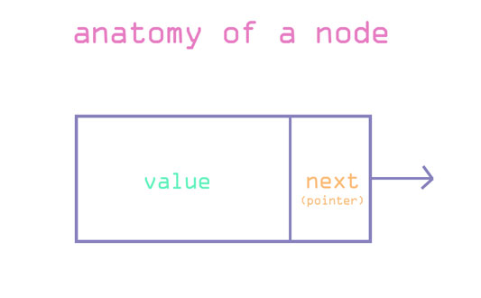

# Linked List

### What is a Linked List?

A linked list is a collection of **data elements**.

A data element is represented as a **node** in a linked list.

A node consists of two parts: data and a pointer to the next node.

Data elements are linked using pointers and are **not** stored in contiguous memory like arrays

### Resources

[Data Structures: Linked Lists w/ Gayle Laakmann McDowell](https://www.youtube.com/watch?v=njTh_OwMljA&list=PLLXdhg_r2hKA7DPDsunoDZ-Z769jWn4R8&index=3&t=1s)
[Linked Lists In Javascript ES6](https://codeburst.io/linked-lists-in-javascript-es6-code-part-1-6dd349c3dcc3)
[Linked Lists Wikipedia](https://en.wikipedia.org/wiki/Linked_list)
[trekhleb javascript-algorighms](https://github.com/trekhleb/javascript-algorithms)
